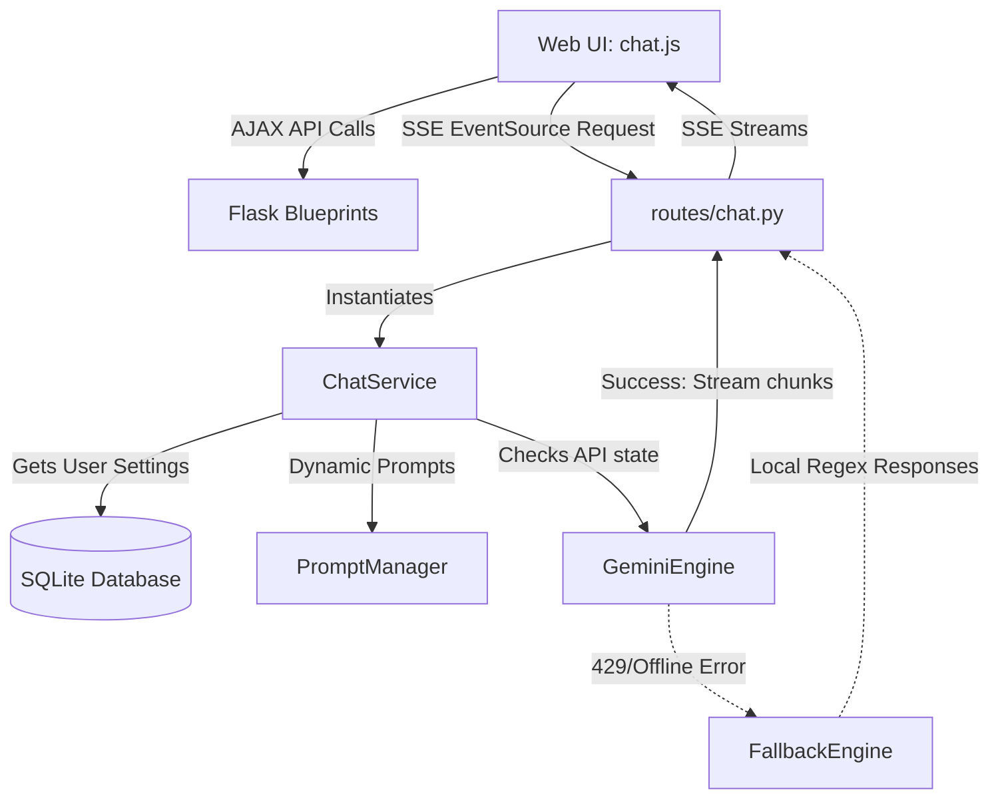

<div align="center">
  
  
  <h1 style="font-weight: 800; font-size: 2.5rem; margin-top: 15px; background: linear-gradient(135deg, #6366f1 0%, #a855f7 100%); -webkit-background-clip: text; -webkit-text-fill-color: transparent;">Abdullah Assistant AI</h1>
  
  <p style="font-weight: 500; font-size: 1.1rem; color: #9ca3af; max-width: 600px; margin: 10px auto;">
    A state-of-the-art, premium AI SaaS chatbot platform mimicking commercial architectures like ChatGPT and Gemini. Fully optimized for production.
  </p>

  <div style="margin: 20px 0;">
    
    
    
    
    
  </div>
</div>

---

<h2 style="border-bottom: 2px solid #3b82f6; padding-bottom: 8px;">📋 Project Context & Attribution</h2>

<table style="width: 100%; border-collapse: collapse; margin: 20px 0;">
  <tr style="background-color: rgba(99, 102, 241, 0.05);">
    <td style="padding: 12px; font-weight: bold; width: 30%;">Project Context</td>
    <td style="padding: 12px;">Based on the original <strong>DecodeLabs Project</strong> Chatbot Assignment</td>
  </tr>
  <tr>
    <td style="padding: 12px; font-weight: bold;">Platform Name</td>
    <td style="padding: 12px;"><strong>Abdullah Assistant AI</strong></td>
  </tr>
  <tr style="background-color: rgba(99, 102, 241, 0.05);">
    <td style="padding: 12px; font-weight: bold;">Core Enhancement</td>
    <td style="padding: 12px;">Transformed from a rule-based CLI script into a production-ready web SaaS console</td>
  </tr>
  <tr>
    <td style="padding: 12px; font-weight: bold;">Developed By</td>
    <td style="padding: 12px;"><strong>Muhammad Abdullah</strong> (AI Engineer / Backend Developer)</td>
  </tr>
</table>

---

<h2 style="border-bottom: 2px solid #3b82f6; padding-bottom: 8px;">✨ Key Capabilities</h2>

<div style="display: grid; grid-template-columns: 1fr 1fr; gap: 20px; margin: 20px 0;">
  
  <div style="padding: 20px; border: 1px solid rgba(255,255,255,0.08); border-radius: 12px; background: rgba(15,17,26,0.45); backdrop-filter: blur(12px);">
    <h3 style="margin-top: 0; color: #6366f1;">💬 Premium ChatGPT Layout</h3>
    <ul style="padding-left: 20px; margin-bottom: 0;">
      <li><strong>SSE Text Streaming</strong>: Smooth chunk-by-chunk real-time response rendering.</li>
      <li><strong>Directory Sidebar</strong>: Pin, folder-organize, search, rename, and delete conversation history asynchronously.</li>
      <li><strong>Rich Text Rendering</strong>: Full support for Markdown, highlighted code blocks with Copy buttons, and equations.</li>
    </ul>
  </div>

  <div style="padding: 20px; border: 1px solid rgba(255,255,255,0.08); border-radius: 12px; background: rgba(15,17,26,0.45); backdrop-filter: blur(12px);">
    <h3 style="margin-top: 0; color: #a855f7;">🔒 Secure Multi-User SaaS</h3>
    <ul style="padding-left: 20px; margin-bottom: 0;">
      <li><strong>Authentication</strong>: Secure session lifecycle managed by Flask-Login and PBKDF2 password hashing.</li>
      <li><strong>Individual Settings</strong>: Custom API key binding, dynamic model selection, and prompt overrides saved to database settings.</li>
      <li><strong>Voice Console</strong>: Web Speech API voice synthesis (TTS output reader) and dictation (voice input mic).</li>
    </ul>
  </div>

  <div style="padding: 20px; border: 1px solid rgba(255,255,255,0.08); border-radius: 12px; background: rgba(15,17,26,0.45); backdrop-filter: blur(12px);">
    <h3 style="margin-top: 0; color: #10b981;">📊 Analytics & Metrics</h3>
    <ul style="padding-left: 20px; margin-bottom: 0;">
      <li><strong>Usage Dashboards</strong>: Charts showing total messages and estimated token counts mapped over time.</li>
      <li><strong>Dynamic Indicators</strong>: Visual dots displaying whether the engine is hitting live APIs (Green) or fallback (Yellow).</li>
    </ul>
  </div>

  <div style="padding: 20px; border: 1px solid rgba(255,255,255,0.08); border-radius: 12px; background: rgba(15,17,26,0.45); backdrop-filter: blur(12px);">
    <h3 style="margin-top: 0; color: #f59e0b;">🧠 Contextual Session Memory</h3>
    <ul style="padding-left: 20px; margin-bottom: 0;">
      <li><strong>Session Variables</strong>: Stores user's name, active topic, and conversational context inside Flask Session cookies.</li>
      <li><strong>System Injector</strong>: Pushes session variables directly to Gemini system instructions to personalise replies.</li>
    </ul>
  </div>

</div>

---

<h2 style="border-bottom: 2px solid #3b82f6; padding-bottom: 8px;">🏗️ Architecture & Technical Stack</h2>



* **Backend**: Python 3.13, Flask 3.0.3, Flask-SQLAlchemy, Flask-Login, python-dotenv
* **Frontend**: ES6 Javascript, Custom Glassmorphism CSS Design system (Theme support: Dark/Light Mode)
* **AI Core**: Google Gemini Python SDK (`google-genai`) client targeting `models/gemini-2.5-flash`
* **Local Fallback**: Regex patterns and response templates in `data/` directory

---

<h2 style="border-bottom: 2px solid #3b82f6; padding-bottom: 8px;">📂 Cleaned Folder Structure</h2>

```
Abdullah-Assistant-AI/
│
├── config.py                 # Central configurations (Flask, DB, API Defaults)
├── app.py                    # Main app entry point (Registers blueprints, hooks DB)
├── requirements.txt          # Production dependencies
├── run.bat                   # CLI startup script (Windows)
├── run.sh                    # CLI startup script (Unix/Mac)
│
├── data/
│   ├── intents.json          # Predefined intent patterns for local fallback
│   └── responses.json        # Dynamic template answers for local fallback
│
├── src/
│   ├── ai/
│   │   ├── gemini_engine.py  # Gemini API client wrapper (streaming + system instruction)
│   │   ├── fallback_engine.py# Intelligent local pattern matching fallback generator
│   │   ├── prompt_manager.py # Manages assistant system prompts and persona overrides
│   │   └── memory.py         # Standard context payload packaging
│   │
│   ├── chat/
│   │   └── chat_service.py   # Database lifecycle driver (conversations, messages)
│   │
│   ├── routes/
│   │   ├── main.py           # Landing home routes
│   │   ├── auth.py           # Registration & Login endpoints
│   │   ├── api.py            # Ajax calls for pinning, usage logs, settings saves
│   │   └── chat.py           # Workspace console & SSE streaming controllers
│   │
│   └── user/
│       ├── database.py       # Hooks DB instance
│       └── models.py         # SQLAlchemy model definitions
│
├── static/
│   ├── css/                  # Premium glassmorphic styles
│   │   ├── style.css         # Global design tokens and auth cards
│   │   ├── dashboard.css     # Stats cards layout
│   │   └── chat.css          # Left-sidebar/chat view console grid
│   │
│   ├── js/                   # Frontend controllers
│   │   ├── theme.js          # Dark/Light selector
│   │   ├── voice.js          # Speech-to-text / TTS output managers
│   │   └── chat.js           # AJAX operations and markdown rendering
│   │
│   └── img/
│       └── avatar-default.png# Generated default profile picture
│
└── templates/                # Jinja2 HTML layout blueprints
    ├── base.html             # Navigation wrappers
    ├── index.html            # Landing promo view
    ├── login.html            # Login panels
    ├── register.html         # Sign up panels
    ├── dashboard.html        # Stats charts
    ├── chat.html             # Active chat console
    ├── settings.html         # Keys/prompts updates panel
    ├── profile.html          # Profile picture resets
    └── about.html            # Technical details page
```

---

<h2 style="border-bottom: 2px solid #3b82f6; padding-bottom: 8px;">⚙️ Installation & Launch Guide</h2>

### 1. Clone the project
```bash
git clone https://github.com/muhammadabdullah-devpk/DecodeLabs-Abdullah-Assistant-AI.git
cd DecodeLabs-Abdullah-Assistant-AI
```

### 2. Add Environment variables
Create a `.env` file in the root folder with:
```env
SECRET_KEY=your_secret_key_string
GEMINI_API_KEY=YOUR_GOOGLE_GEMINI_API_KEY
DEFAULT_MODEL=models/gemini-2.5-flash
```

### 3. Startup Scripts (One-Click)
- **Windows**: Double-click `run.bat` or run:
  ```cmd
  run.bat
  ```
- **Linux/Mac**: Run:
  ```bash
  chmod +x run.sh
  ./run.sh
  ```

---

<h2 style="border-bottom: 2px solid #3b82f6; padding-bottom: 8px;">🤖 Conversational Local Fallback</h2>

If the Gemini API key is missing or rate-limited (429), the chatbot drops down to a custom regex reasoning processor (`src/ai/fallback_engine.py`) which replies politely and guides user input:
* **Small Talk & Greet**: Personalised greetings referencing name changes.
* **Math Solves**: Safe arithmetic evaluation using mathematical syntax (`solve 15 * (4 + 6)`).
* **FAQ Systems**: Structured information about Python, AI, rules, and DecodeLabs background.
* **Resume & CV Layouts**: Generates structured Markdown resume outlines.

---

<h2 style="border-bottom: 2px solid #3b82f6; padding-bottom: 8px;">👨‍💻 Developer & Project Showcase</h2>

<div style="padding: 24px; border: 1px solid rgba(99, 102, 241, 0.2); border-radius: 16px; background: linear-gradient(135deg, rgba(10,11,16,0.95) 0%, rgba(18,20,29,0.95) 100%); margin: 20px 0; box-shadow: var(--shadow-premium);">
  
  <div style="display: flex; gap: 20px; align-items: center; flex-wrap: wrap;">
    
    <div>
      <h3 style="margin: 0; font-size: 1.4rem; color: #fff;">Muhammad Abdullah</h3>
      <p style="margin: 3px 0 10px 0; color: #a855f7; font-weight: 600; font-size: 0.9rem; text-transform: uppercase; letter-spacing: 0.5px;">AI Engineer | Python Developer | Machine Learning Enthusiast</p>
    </div>
  </div>

  <hr style="border: 0; border-top: 1px solid rgba(255,255,255,0.08); margin: 15px 0;">

  <div style="display: grid; grid-template-columns: 1fr 1fr; gap: 12px; font-size: 0.95rem;">
    <div><strong>Project Type:</strong> DecodeLabs Project</div>
    <div><strong>Project Title:</strong> Abdullah Assistant AI</div>
    <div><strong>Role Contribution:</strong> Enhanced & Developed by Muhammad Abdullah</div>
    <div><strong>Developer Name:</strong> Muhammad Abdullah</div>
  </div>

  <div style="margin-top: 20px; display: flex; gap: 15px; flex-wrap: wrap;">
    <a href="https://github.com/muhammadabdullah-devpk" target="_blank" style="padding: 8px 16px; background: #24292e; color: #fff; border-radius: 8px; text-decoration: none; font-weight: 600; font-size: 0.85rem;"><i class="fa-brands fa-github"></i> GitHub</a>
    <a href="https://linkedin.com/in/muhammad-abdullah-devpk" target="_blank" style="padding: 8px 16px; background: #0077b5; color: #fff; border-radius: 8px; text-decoration: none; font-weight: 600; font-size: 0.85rem;"><i class="fa-brands fa-linkedin"></i> LinkedIn</a>
    <a href="mailto:meharabdullah4337@gmail.com" style="padding: 8px 16px; background: #db4437; color: #fff; border-radius: 8px; text-decoration: none; font-weight: 600; font-size: 0.85rem;"><i class="fa-solid fa-envelope"></i> Email</a>
  </div>

</div>